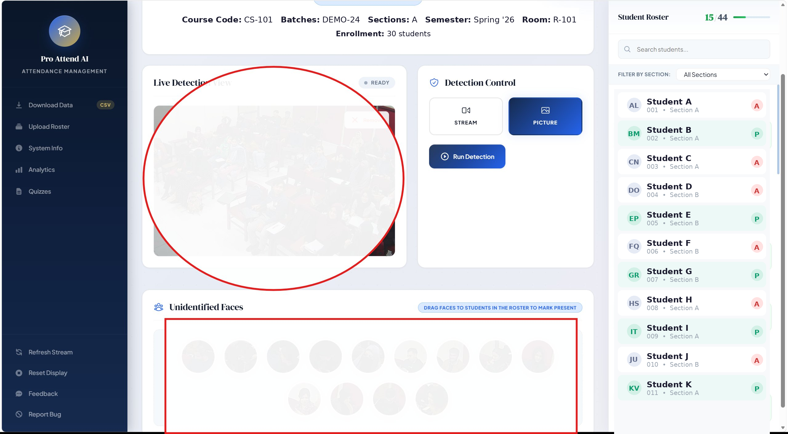
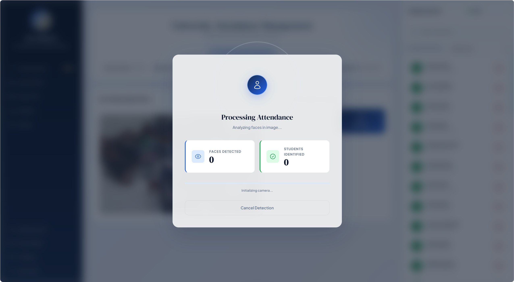

<div align="center">

# Pro Attend AI

### Real-time classroom attendance, powered by face recognition.

Point a camera at your classroom. The system detects every face, matches each one against a per-student reference embedding, and writes a verifiable, timestamped attendance record — no roll-call, no sign-in sheet, no trust issues.

<p>
  
  
  
  
  
</p>

<sub>RetinaFace detection · ArcFace embeddings · dual-path extraction · multi-frame fusion · live RTSP · Django 5 · MIT licensed</sub>

</div>

---

## Why this exists

Manual roll-call is slow, forgeable, and loses hours of instructional time every week. Commercial attendance systems are closed-source, institution-priced, and ship biometric data to third-party servers.

**Pro Attend AI runs entirely on your own machine.** Biometrics never leave the server you installed it on. The source is here; you can read every line.

---

## Screenshots



*The instructor dashboard during a session. Live detection view (left) ingests from the classroom camera; recognised students flip to **Present** in the roster (right); unrecognised faces drop into the **Unidentified Faces** row at the bottom, ready to be dragged onto a student card to retrain that student's reference embedding. Faces are obscured and the roster shown here is demo data — real deployments show real names.*



*The processing modal that appears while detection is running. Faces-detected and students-identified counters update live as frames are processed across the multi-frame fusion window, giving immediate feedback to the operator instead of a frozen spinner.*

---

## Features

**Recognition pipeline**
- **RetinaFace** detection → **ArcFace 512-d** embeddings (InsightFace `buffalo_l`)
- **Dual-path extraction** — every face is embedded twice: once from a tight crop with brightness normalisation, once from a margin crop with CLAHE. The higher cosine similarity wins. This reliably recovers matches that single-pass pipelines miss on real classroom CCTV footage.
- **Multi-frame fusion** — recognition is the consensus across N consecutive frames (default 5), so blinks, motion blur, and brief head turns don't cost anyone their attendance mark.
- **Thread-safe embedding store** with atomic reloads.

**Deployment reality**
- **Live RTSP streams** with a browser-friendly MJPEG bridge.
- **Background model warm-up** — the first recognition call doesn't pay the 8–15 second cold-start cost; InsightFace loads on Django boot in a daemon thread.
- **Per-day classroom overrides** — swap rooms for a day without editing a schedule.
- **CPU or GPU** — flip one argument in `views.py` to use `CUDAExecutionProvider`.

**Operator workflow**
- **Face Manager UI** — capture frames → auto-cluster unknown faces into identities → drag-and-drop onto student cards → automatic retraining. No notebook, no CLI, no touching model weights.
- **CSV roster import** with auto-created batches and sections.
- **CSV export** — attendance matrix, per-session stats, optional detailed time log, all timezone-aware.

**Engineering**
- Configuration via environment variables (`.env.example` documents every knob).
- Production-hardening (HSTS, secure cookies, SSL redirect) auto-engages when `DEBUG=False`.
- Real test suite (~25 cases) covering model invariants, pure helpers, auth guards, and regressions.

---

## Architecture

```
 ┌───────────────┐     ┌──────────────────┐     ┌───────────────────┐
 │ Classroom cam │────▶│  RTSP ingest     │────▶│  RetinaFace       │
 │ (RTSP / IP)   │     │  (OpenCV MJPEG)  │     │  face detection   │
 └───────────────┘     └──────────────────┘     └────────┬──────────┘
                                                         │  N frames
                                                         ▼
   ┌──────────────────────────┐          ┌────────────────────────────┐
   │  Per-student reference   │          │  ArcFace dual-path embed   │
   │  embeddings  (.npy)      │◀────────▶│  tight crop + bright-norm  │
   │  thread-safe dict        │  cosine  │  margin crop + CLAHE       │
   └──────────┬───────────────┘          └─────────────┬──────────────┘
              │                                        │ max sim
              │                                        ▼
              │                         ┌──────────────────────────────┐
              │                         │  Multi-frame fusion (N=5)    │
              │                         │  threshold + tie-break       │
              │                         └──────────────┬───────────────┘
              │                                        │
              ▼                                        ▼
   ┌──────────────────────────────────────────────────────────────────┐
   │  Django backend — AttendanceRecord rows, per-class CSV exports,  │
   │  Face Manager identity-correction UI, roster + override admin    │
   └──────────────────────────────────────────────────────────────────┘
```

**Read these files first** if you want to understand the codebase:

| File | What's in it |
| --- | --- |
| [`Attendance/views.py`](Attendance/views.py) | All HTTP/JSON endpoints + recognition wiring (`_process_detected_faces`, `_process_multi_frame`). |
| [`Attendance/pipeline.py`](Attendance/pipeline.py) | Identity extraction, clustering, retraining used by the Face Manager UI. |
| [`Attendance/models.py`](Attendance/models.py) | Ten domain models — Teacher, Course, Batch, Section, Class, Enrollment, AttendanceRecord, ClassroomOverride, ExtractionSession, Identity, FaceSample. |
| [`Attendance/apps.py`](Attendance/apps.py) | `AttendanceConfig.ready()` → `_background_startup()` warms the face models. |

---

## Quickstart

### Prerequisites

- Python **3.10+**
- ~2 GB free disk (InsightFace `buffalo_l` weights download on first run into `~/.insightface/`)
- An RTSP-capable camera **or** a local image to upload (for testing)

### Install

```bash
git clone https://github.com/<your-username>/<your-repo>.git
cd <your-repo>

python -m venv .venv
source .venv/bin/activate          # Windows: .venv\Scripts\activate

pip install -r requirements.txt

cp .env.example .env               # then edit DJANGO_SECRET_KEY etc.
export $(grep -v '^#' .env | xargs)

python manage.py migrate
python manage.py createsuperuser
python manage.py runserver
```

Open **http://localhost:8000/** and sign in.

> **Heads-up:** a freshly created superuser is not automatically a teacher. Visit `/admin/`, create a `Teacher` profile pointing at your user, then the dashboard will let you in.

### First-run checklist

1. **Generate a real `SECRET_KEY`**
   ```bash
   python -c "from django.core.management.utils import get_random_secret_key; print(get_random_secret_key())"
   ```
   paste it into `.env` as `DJANGO_SECRET_KEY=...`
2. **Set `DJANGO_DEBUG=false`** before exposing the server to anything outside `localhost`.
3. **Create at least one `Teacher`, `Course`, `Batch`, `Section`, `Class`** via `/admin/` (or upload a roster CSV — see below).
4. **Enroll face references** via the **Face Manager** UI (`/face-manager/?class_id=<id>`). Upload frames → label identities → the system writes `<First_Last>_embeddings.npy` into `Attendance/Models/`.
5. **Take attendance.** Dashboard → `Take Attendance` → pick **Live Stream** or **Upload Image** → hit **Start**.

---

## Usage

### Endpoint map

| Action | URL | Notes |
| --- | --- | --- |
| Login / Logout | `/login/`, `/logout/` | |
| Instructor dashboard | `/dashboard/` | Login required |
| Take attendance | `/attendance/?class_id=<id>` | Live or upload |
| Download CSV | `/download_attendance/?class_id=<id>` | add `&include_time_log=true` for the detailed log |
| Upload roster CSV | `POST /upload_csv/` | multipart, field `csvFile` |
| Set classroom override | `POST /set_classroom_override/` | per-day room swap |
| Face manager | `/face-manager/?class_id=<id>` | identity-correction UI |
| Reload embeddings | `POST /reload_embeddings/` | after bulk roster changes |

### Roster CSV format

```
registration_id,first_name,last_name,batch_code,section,email,embedding_file,images_folder
CS-0001,Ada,Lovelace,BCS-2024,A,ada@example.edu,Ada_Lovelace_embeddings.npy,/path/to/ref_photos/ada
```

Missing batches and sections are auto-created on first import.

### Tuning recognition

Every knob is an env var (see [`.env.example`](.env.example)):

| Variable | Default | What it does |
| --- | --- | --- |
| `ATTENDANCE_SIMILARITY_THRESHOLD` | `0.4` | Cosine threshold for a positive match. Lower = more permissive. |
| `ATTENDANCE_MULTI_FRAME_COUNT` | `5` | Frames captured per attendance call. Higher = more robust, slower. |
| `ATTENDANCE_MIN_FACE_SIZE` | `30` | Minimum face width (px). Faces smaller than this are ignored. |
| `ATTENDANCE_MAX_UPLOAD_MB` | `60` | Max image upload size. |
| `ATTENDANCE_STREAM_FPS` | `25` | MJPEG playback FPS. |

---

## Project layout

```
.
├── manage.py
├── README.md
├── LICENSE
├── requirements.txt
├── .env.example                        # every recognised env var, documented
├── .gitignore                          # blocks .npy, sqlite, face crops, etc.
│
├── My_Project/                         # Django project package
│   ├── settings.py                     # env-driven; auto-hardens when DEBUG=False
│   ├── urls.py                         # mounts Attendance.urls at "/"
│   ├── wsgi.py
│   └── asgi.py
│
├── media/                              # created at runtime; gitignored
│
├── docs/
│   └── screenshots/                    # README screenshots
│
└── Attendance/                         # main app
    ├── apps.py                         # background model warm-up on boot
    ├── models.py                       # domain models (10)
    ├── admin.py                        # full admin registrations
    ├── views.py                        # all endpoints + ML wiring
    ├── pipeline.py                     # clustering + retraining for Face Manager
    ├── urls.py
    ├── tests.py                        # ~25 cases
    ├── migrations/
    ├── Models/                         # per-student .npy embeddings (gitignored)
    │   └── README.md                   # how to populate this dir
    ├── templates/Attendance/           # login, dashboard, attendance, face_manager
    └── static/Attendance/              # CSS + JS for the SPA-ish UIs
```

---

## Testing

```bash
python manage.py test Attendance
```

The test suite covers:

- **Model invariants** — `unique_together` constraints, helper properties.
- **Pure helpers** that don't need ML weights (`_l2_normalize`, `crop_face_region`, `encode_pil_image_base64`, `create_image_augmentations`).
- **Auth & authorisation** — dashboard context, classroom-override dates, CSV download with empty marker lists, cross-tenant class-access rejection.
- **Pipeline endpoint guards** — `pipeline_retrain` refuses calls without `class_id`/`identity_id`, closing a cross-tenant data leak.

The ML pipelines (RetinaFace / InsightFace) are **not** invoked from tests; they need ~250 MB of model weights and are inappropriate for unit tests. ML-dependent endpoints are tested via monkey-patched `_process_detected_faces` to keep CI hermetic.

---

## Production notes

- **Swap SQLite for PostgreSQL.** SQLite is fine for one classroom; for a faculty-wide install, `DATABASES` should point at Postgres and embeddings live on a mounted volume.
- **Run behind a reverse proxy.** Nginx → Gunicorn → Django. The hardening block in `settings.py` expects `X-Forwarded-Proto` from a proxy.
- **GPU inference.** In `views.py`, change the InsightFace initialisation `providers=['CPUExecutionProvider']` to `providers=['CUDAExecutionProvider', 'CPUExecutionProvider']`. Expect ~10× speedup on batched frames.
- **Background work.** Retraining and embedding reload run inside the request cycle today. For classes with hundreds of identities, wrap them in Celery or RQ.
- **Single-tenant by default.** Every teacher sees every class in `/admin/`. Multi-tenant deployments need an organisation layer.

---

## Privacy & ethics

Face embeddings are biometric data. Please:

1. **Never commit `.npy` embedding files or face crops** to any repository. The [`.gitignore`](.gitignore) shipped here blocks them by default — keep it that way.
2. **Get informed, affirmative consent** from every person whose face the system will recognise. Tell them what's stored, where, for how long, and how to opt out.
3. **Provide a deletion path.** A student who leaves should have their embedding row and `.npy` file removed the same day.
4. **Don't expose the face-capture endpoints to the open internet.** Keep the server on a campus network or behind a VPN.
5. **Comply with your local biometric-data law** — GDPR (EU), BIPA (Illinois), PDPA (Singapore), and your country's equivalent. The burden is on the operator, not the software.

This project is an engineering tool. Using it responsibly is your job.

---

## Roadmap

- [ ] Postgres-backed embedding store (replace in-process dict with pgvector).
- [ ] Celery worker for retraining and bulk reloads.
- [ ] Multi-tenant organisation layer.
- [ ] Opt-out / data-deletion self-service UI for students.
- [ ] Liveness detection (anti-photo-spoof).
- [ ] ONNX Runtime GPU build in `requirements-gpu.txt`.
- [ ] Docker Compose quickstart.

PRs welcome for any of the above.

---

## Contributing

1. Fork → create a feature branch → keep changes scoped to a single capability or fix.
2. Run `python manage.py test Attendance` and add a test for any new behaviour or bug fix.
3. Keep view functions skinny — heavy logic belongs in `pipeline.py` or a sibling helper module.
4. PRs that touch recognition behaviour should include a short note on how you measured accuracy (e.g. before/after recognition rate on a sample dataset).

Bug reports and feature requests: open an issue.

---

## Acknowledgements

- [InsightFace](https://github.com/deepinsight/insightface) for RetinaFace and ArcFace.
- [Django](https://www.djangoproject.com/) for the backbone.
- Everyone who took attendance by hand and knew there had to be a better way.

---

## License

[MIT](LICENSE) — do what you want, just don't sue me.

<div align="center">
<sub>If this project saves you time, a ⭐ on GitHub is the cheapest way to say thanks.</sub>
</div>
